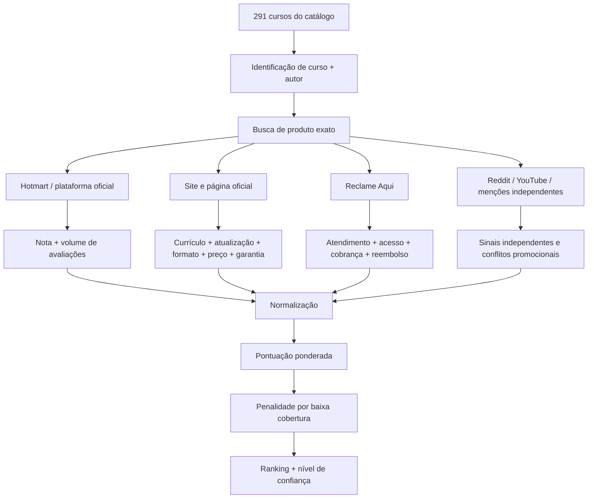
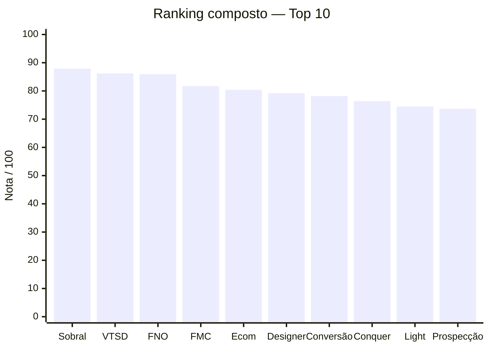

# Auditoria aprofundada do catálogo de cursos

## Resumo executivo

O arquivo fornecido contém **291 cursos**. Em vez de presumir que notoriedade do autor ou uma nota isolada significa “melhor curso”, tratei a análise como uma auditoria de evidências: reputação direta de compradores, atendimento pós-venda, desenho pedagógico observável, atualização, aplicação prática, suporte, provas de resultado e preço oficial.

A conclusão principal é que há **três respostas diferentes** para “qual é o melhor”:

**Melhor curso no composto geral:** **Comunidade Sobral/Subido de Tráfego**, com **87,9/100**. A vantagem vem da profundidade e organização do currículo, atualização explícita, aplicação profissional e infraestrutura contínua de suporte. A versão oficial atual foi renovada/regravada e cobre do básico ao avançado, incluindo Meta Ads, Google Ads, TikTok, LinkedIn, prospecção, vendas, tracking, GA4/GTM/Looker Studio, tutorias de IA e tira-dúvidas mensal. citeturn19view5turn19view6

**Melhor evidência reputacional dura:** **Fórmula Negócio Online**, com **4,6/5 em 11.294 avaliações diretas na Hotmart** — uma escala de reviews que nenhum outro curso que consegui verificar no catálogo se aproximou. A versão oficial encontrada é explicitamente 2026, custa atualmente R$297, oferece garantia de sete dias e apresenta currículo em quatro pilares. citeturn17view0turn19view0turn19view1

**Melhor combinação de atualização, aplicabilidade e provas comerciais:** **Venda Todo Santo Dia**, segundo no composto, com **86,2/100**. A oferta atual tem currículo estruturado por fases, mais de 45 agentes de IA, comunidade, suporte ao vivo quinzenal, garantia de 15 dias e uma grande biblioteca de casos apresentados pelo produtor. O ponto que o impede de ultrapassar o Sobral e reduz sua confiança é que boa parte das provas vem do próprio vendedor e a empresa apresenta reputação mais modesta no Reclame Aqui, em torno de 7,3/10. citeturn23view0turn23view1turn4search2

Meu **Top 10 composto**, após ponderar todas as dimensões, ficou:

| Posição | Curso                                                            |     Nota | Confiança | Principal razão                                                         |
| ------- | ---------------------------------------------------------------- | -------: | --------- | ----------------------------------------------------------------------- |
| **1**   | **Comunidade Sobral/Subido de Tráfego — Pedro Sobral**           | **87,9** | B+        | Melhor combinação de profundidade, atualização, prática e suporte       |
| **2**   | **Venda Todo Santo Dia — Leandro Ladeira**                       | **86,2** | B         | Currículo implementável, muito atualizado e grande ecossistema de casos |
| **3**   | **Fórmula Negócio Online — Alex Vargas**                         | **85,9** | **A**     | De longe a evidência quantitativa de satisfação mais robusta            |
| **4**   | **Formação Social Media / Marketing de Conteúdo — Rejane Toigo** | **81,7** | B         | Excelente desenho profissionalizante e operacional                      |
| **5**   | **Ecommerce do Zero 4.0 — Bruno de Oliveira**                    | **80,4** | B         | Currículo estruturado + reputação institucional excepcional             |
| **6**   | **A Escola do Designer — Gilson Azevedo**                        | **79,2** | B−        | Boa pedagogia teoria→ferramenta→prática e custo oficial muito baixo     |
| **7**   | **Conversão Extrema — Tiago Tessmann**                           | **78,2** | B         | Forte conteúdo de performance; suporte é o principal ponto fraco        |
| **8**   | **Destravando a Sua Comunicação — Conquer**                      | **76,4** | B         | Alta aplicabilidade e reputação institucional consistente               |
| **9**   | **Light Copy — Leandro Ladeira**                                 | **74,5** | B−        | Boa abordagem conceitual de copy, sem depender de fórmulas prontas      |
| **10**  | **Máquina de Prospecção — Giovanne Saraiva**                     | **73,7** | B         | Excelente aplicabilidade e 45 avaliações diretas verificáveis           |

Um resultado importante é que **“mais estrelas” não significa automaticamente “melhor”**. Reels Superpoderoso tem 4,9/5, mas em apenas 20 avaliações; AI Designer aparece com 2,0/5, mas somente duas avaliações. Já o FNO tem 11.294. Para não permitir que uma amostra minúscula domine o ranking, corrigi matematicamente as notas pelo tamanho da amostra. citeturn17view0turn17view1turn17view5

Também apareceu uma surpresa relevante: **Mestres do Bitcoin 3.0 tem 4,7/5 em 878 avaliações**, sendo uma das maiores massas de reviews diretos de todo o conjunto investigado. Mesmo assim, terminou apenas em 15º no composto porque a edição 3.0 contém material temporalmente sensível, a oferta oficial atual a trata dentro de uma formação mais nova, resultados de trading/cripto são intrinsecamente menos replicáveis e encontrei ceticismo independente relevante sobre o valor de cursos desse tipo. citeturn24search0turn25search12turn25search1

O arquivo de auditoria contém o catálogo completo, o ranking detalhado, as métricas, os URLs primários, os cenários de sensibilidade e os **291 registros**, marcando os não aprofundados como **“sem evidência pública verificada nesta rodada”**:

[**Baixar a planilha completa da auditoria dos 291 cursos**](sandbox:/mnt/data/auditoria_ranking_291_cursos.xlsx)

## Metodologia e desenho da evidência

O maior problema metodológico deste tipo de ranking é que infoprodutos não possuem uma base neutra equivalente a Rotten Tomatoes, Metacritic ou avaliações acadêmicas. As evidências públicas são fragmentadas e frequentemente controladas pelo próprio produtor.

Inclusive, a própria Hotmart permite ao produtor configurar a exibição de avaliações; portanto, **ausência de nota pública na Hotmart não pode ser interpretada como zero avaliações ou como curso ruim**. A Hotmart também reconhece nota e quantidade de avaliações como dimensões distintas de descoberta do produto. citeturn13search0turn13search12

Por isso, usei uma hierarquia de evidências:

### Métricas e ponderação

| Dimensão | Peso | O que mede | Por que entrou |
|---|---:|---|---|
| **Hotmart ajustada por volume** | **20%** | Média de estrelas + tamanho da amostra | É a evidência mais próxima de avaliação direta de compradores |
| **Reclame Aqui** | **10%** | Atendimento, resolução, cobrança, acesso, reembolso | Captura o que landing pages normalmente não mostram |
| **Menções independentes** | **5%** | Reddit, YouTube e outras discussões externas | Ajuda a detectar discrepância entre marketing e experiência |
| **Qualidade pedagógica observável** | **15%** | Sequência, fundamentos, prática, projetos, progressão | Um curso pode ser popular e pedagogicamente ruim |
| **Atualidade** | **10%** | Regravação, versão, ferramentas atuais, manutenção | Crucial em tráfego, IA, e-commerce, cripto e redes sociais |
| **Formato, suporte e garantia** | **10%** | Ao vivo/gravado, comunidade, tira-dúvidas, acesso, reembolso | Afeta significativamente o valor real do produto |
| **Aplicabilidade prática** | **15%** | Facilidade de transformar conteúdo em trabalho/entrega | Evita premiar cursos enciclopédicos porém pouco executáveis |
| **Provas de resultado** | **7,5%** | Cases, depoimentos e resultados apresentados | Sinal útil, mas fortemente descontado quando auto-hospedado |
| **Custo-benefício** | **7,5%** | Preço oficial, escopo, suporte e tempo de acesso | Diferencia conhecimento bom de investimento realmente bom |

Uma decisão importante: **não usei os preços do arquivo XCURSOS na dimensão custo-benefício**. Eles não são necessariamente os preços atuais cobrados pelos criadores e não são comparáveis com a oferta oficial completa — que pode incluir comunidade, encontros ao vivo, suporte, atualizações e garantia. O preço utilizado foi o oficial quando publicamente observável.

### Correção das avaliações Hotmart

Uma média 4,9/5 com 20 pessoas não deve automaticamente derrotar 4,6/5 com 11.294 pessoas.

Converto inicialmente a média Hotmart para 0–10 e faço uma retração para uma nota neutra de 5 conforme a amostra diminui:

\[
H = 5 + \sqrt{\frac{n}{n+20}}\times(H_{bruto}-5)
\]

Essa não é uma tentativa de estimar uma “verdade estatística absoluta”; é uma regra de confiabilidade para evitar **small-sample bias**.

O efeito pode ser visto aqui:

| Curso | Hotmart bruta | Reviews | Hotmart ajustada /10 |
|---|---:|---:|---:|
| **Mestres do Bitcoin** | 4,7 | 878 | **9,20** |
| **Fórmula Negócio Online** | 4,6 | 11.294 | **9,00** |
| **Inglês da Vida Real** | 4,7 | 45 | **8,54** |
| **Reels Superpoderoso** | 4,9 | 20 | **8,36** |
| **Kit Gestor de Tráfego** | 4,4 | 40 | **7,86** |
| **Máquina de Prospecção** | 4,3 | 45 | **7,70** |
| **Vende-C** | 4,2 | 5 | **6,34** |
| **AI Designer** | 2,0 | 2 | **4,25** |

As médias e quantidades acima vêm das páginas atuais da Hotmart. citeturn17view0turn17view1turn17view2turn17view3turn17view4turn17view5turn18view9turn24search0

### Dados ausentes e confiança

Não atribuí zero quando um indicador não pôde ser verificado. A nota observada é calculada somente sobre critérios com evidência e recebe uma penalidade leve de cobertura:

\[
S_{final}=S_{observado}\times(0,90+0,10C)
\]

onde \(C\) é a proporção dos pesos para a qual existe evidência.

Isso impede dois erros opostos: **punir um bom curso porque o produtor não mostra reviews** e **premiar um curso opaco porque só encontramos seus pontos fortes**.

Além da pontuação, atribuí confiança qualitativa:

**A** significa evidência excepcionalmente robusta e diversificada; **B/B+**, evidência suficiente para uma conclusão razoável; **B−**, conclusão útil porém com lacunas relevantes; **C+**, conflito de sinais ou amostra insuficiente.

YouTube foi deliberadamente pouco pesado. Na busca por reviews de FNO, por exemplo, vários vídeos de “vale a pena?” também ofereciam descontos, bônus ou links de compra, criando evidente conflito comercial. citeturn20search2turn20search6turn20search7 Google Reviews também não produziu uma base homogênea curso-a-curso que pudesse ser comparada honestamente, então não criei uma falsa precisão colocando “nota Google” onde a entidade avaliada seria a empresa, uma unidade física ou outra oferta.

## Coleta comparativa e ranking final

A tabela abaixo é o núcleo quantitativo. As notas pedagógicas e de aplicabilidade são avaliações estruturadas das características publicamente observáveis — não alego que sejam avaliações de alunos.

**“—” significa ausência de evidência pública comparável, não zero.**

| # | Curso | Hotmart média / n | RA | Indep. | Pedag. | Atual | Suporte | Aplic. | Provas | C/B | Final |
|---:|---|---:|---:|---:|---:|---:|---:|---:|---:|---:|---:|
| **1** | **Sobral/Subido** citeturn19view5turn19view6turn4search1turn21search19 | — | 7,8 | 9,0 | **9,5** | **10** | **9,5** | **9,5** | 7,0 | — | **87,9** |
| **2** | **Venda Todo Santo Dia** citeturn23view0turn23view1turn4search2turn21search8 | — | 7,3 | 8,0 | 9,2 | **10** | 8,5 | **9,5** | **8,5** | — | **86,2** |
| **3** | **Fórmula Negócio Online** citeturn17view0turn19view0turn19view1turn15search7 | **4,6 / 11.294** | 8,5* | 6,5 | 8,5 | **10** | 7,5 | 9,0 | 7,0 | **9,5** | **85,9** |
| **4** | **Formação Social Media / Marketing de Conteúdo** citeturn19view7turn19view8turn4search3 | — | — | 5,5 | 9,2 | 9,0 | 9,0 | **9,5** | 6,5 | 7,0 | **81,7** |
| **5** | **Ecommerce do Zero 4.0** citeturn19view4turn2search15 | — | **9,3** | 6,0 | 8,5 | 7,5 | 9,0 | 9,0 | 6,5 | — | **80,4** |
| **6** | **A Escola do Designer** citeturn19view9turn19view10 | — | — | 5,0 | **9,0** | 7,5 | 8,5 | 9,0 | 5,5 | **10** | **79,2** |
| **7** | **Conversão Extrema** citeturn4search11turn21search3turn12search17 | — | 7,9 | 8,0 | 8,5 | 8,0 | 6,5 | 9,0 | 7,5 | — | **78,2** |
| **8** | **Destravando a Sua Comunicação** citeturn2search1turn1search1 | — | 8,3 | 7,0 | 8,2 | 7,0 | 7,5 | 9,0 | 6,5 | — | **76,4** |
| **9** | **Light Copy** citeturn18view8turn4search2 | — | 7,3† | 6,0 | 8,5 | 8,0 | 6,5 | 9,0 | 6,0 | — | **74,5** |
| **10** | **Máquina de Prospecção** citeturn17view2turn15search1 | **4,3 / 45** | — | 5,0 | 8,5 | 7,0 | 5,5 | **9,5** | 6,0 | — | **73,7** |
| 11 | Inglês da Vida Real citeturn17view3 | **4,7 / 45** | — | 5,5 | 8,3 | 6,0 | 6,0 | 8,5 | 6,0 | — | 73,3 |
| 12 | AI Designer citeturn17view5turn18view6turn2search2 | **2,0 / 2** | **8,5**‡ | 5,0 | 8,5 | **10** | 7,5 | 9,0 | 5,0 | — | 71,9 |
| 13 | Reels Superpoderoso citeturn17view1 | **4,9 / 20** | — | 5,5 | 7,5 | 6,0 | 5,5 | 9,0 | 5,5 | — | 71,3 |
| 14 | Vende-C citeturn18view9turn16search0 | **4,2 / 5** | — | 5,5 | 8,5 | 5,5 | 8,5 | 9,0 | 5,5 | — | 71,2 |
| 15 | Mestres do Bitcoin 3.0 citeturn24search0turn25search12turn25search1 | **4,7 / 878** | — | 3,5 | 8,0 | 5,5 | 6,0 | 6,5 | 6,5 | 6,0 | 69,1 |
| 16 | Kit Gestor de Tráfego citeturn17view4 | **4,4 / 40** | — | 5,0 | 7,0 | 6,0 | 5,0 | 9,0 | 5,0 | — | 67,8 |

\* Para FNO, 8,5 é a **média dos consumidores avaliadores** encontrada no período exibido pelo Reclame Aqui; a própria página naquele recorte ainda classificava a empresa como sem reputação definida por sua regra interna. Ela informava 36 reclamações no período, 12 avaliadas, 100% respondidas e 100% resolvidas. citeturn15search7  
† A nota de Light Copy no Reclame Aqui é proxy do ecossistema Ready To Go/Venda Todo Santo Dia, não uma avaliação pedagógica isolada do Light Copy. citeturn4search2  
‡ 8,5 é a reputação da **Asimov Academy**, enquanto 2,0/5 em duas avaliações é do **AI Designer específico**. São sinais diferentes e não devem ser misturados. citeturn17view5turn2search2

### O que explica o topo

**Comunidade Sobral/Subido** venceu não por uma nota isolada, mas por coerência entre currículo e entrega. O material oficial diz que a antiga Comunidade Sobral foi completamente renovada, com conteúdo atualizado e regravado e organização do básico ao avançado. Há seis blocos, indo de tráfego a prospecção/vendas, especializações, habilidades complementares, dados/tracking/relatórios e acervo de lives. A oferta também declara metodologia prática “botão a botão”, IA de apoio e plantão mensal. citeturn19view5turn19view6 Há ainda menções independentes espontâneas favoráveis no Reddit, incluindo alunos destacando a comunidade e a utilidade do suporte, embora isso continue sendo evidência anedótica. citeturn21search4turn21search19

**VTSD** quase empata. Sua página atual é uma das mais completas pedagogicamente entre as auditadas: há concepção do produto, precificação, copy, tráfego, Google Ads, SEO, conteúdo, recuperação de vendas, áreas da empresa e fluxo de caixa, além de uma progressão de implementação em fases. A oferta atual inclui desafios práticos, comunidade, suporte quinzenal no Zoom e garantia de 15 dias. citeturn23view0turn23view1 O produtor apresenta mais de 165 depoimentos e numerosos casos financeiros; tratei isso como evidência positiva, porém **auto-hospedada**, não como auditoria independente. citeturn22view0 Há pelo menos relatos espontâneos positivos fora da página de venda — por exemplo, um usuário do Reddit disse continuar aplicando o método e atribuiu mais de seis dígitos de receita às estratégias — mas uma história individual não demonstra causalidade ou resultado típico. citeturn21search8

**FNO** é o curso que eu consideraria mais “estatisticamente defensável” chamar de bem avaliado. Os 11.294 reviews diretos fazem uma enorme diferença de confiança. A versão oficial encontrada também não parece abandonada: está rotulada como versão 2026 e estruturada em monetização, máquina de vendas, operação/tráfego/automações e análise/crescimento. citeturn17view0turn19view0turn19view1 A página mostra atualmente R$297 e sete dias de garantia, além de diversos resultados de alunos hospedados pelo próprio vendedor. citeturn19view2turn19view3

O que impede o FNO de ser primeiro no composto é a existência de **fricção histórica de suporte/acesso**. No Reclame Aqui aparecem reclamações recentes sobre acesso e, em particular, consumidores antigos discutindo promessas de acesso vitalício e mudanças de plataforma/prazo. A empresa também tem casos resolvidos e consumidores que elogiaram curso e atendimento; portanto, a evidência não justifica dizer que o suporte é simplesmente “ruim”, mas justifica reduzir sua nota em relação ao Sobral. citeturn15search7turn15search25turn15search23

**Formação Social Media**, hoje redirecionada oficialmente para **Formação Marketing de Conteúdo**, foi a grande surpresa pedagógica. A página trabalha sete processos profissionais: prospecção, vendas, estratégia, onboarding, produção, manejo do cliente e administração do negócio. A oferta atual informa 420 aulas práticas, ferramentas de CRM/gestão/financeiro, comunidade, consultoria semanal, um ano de acesso e preço de R$1.497. citeturn19view7turn19view8 Isso é muito mais parecido com uma formação operacional de freelancer/agência do que com um simples “curso de posts”.

**Ecommerce do Zero** se beneficia do sinal institucional mais forte de atendimento entre os principais finalistas: aproximadamente **9,3/10 no Reclame Aqui** no recorte pesquisado. A Hotmart descreve aulas metodológicas/didáticas gravadas, uma progressão do planejamento à escala, passe anual, suporte e comunidade. citeturn2search15turn19view4 Há reclamações individuais sobre reembolso/cancelamento, mas elas coexistem com um agregado institucional muito alto, portanto não há base para usar essas reclamações isoladas como sinal de baixa qualidade geral. citeturn11search0turn11search5

## Reputação qualitativa, reclamações e provas de resultado

O ranking melhora bastante quando se separa **“a aula é boa?”** de **“a empresa presta bom atendimento?”**.

O Reclame Aqui é excelente para a segunda pergunta e apenas indiretamente útil para a primeira.

### Padrões de reputação encontrados

| Curso/ecossistema | Sinal positivo | Sinal negativo ou incerteza | Interpretação |
|---|---|---|---|
| **FNO** | 11.294 reviews Hotmart, 4,6/5; RA recente com alta resolução citeturn17view0turn15search7 | Reclamações recorrentes amostradas sobre acesso/vitaliciedade/suporte citeturn15search25turn15search18 | **Produto muito validado; pós-venda merece atenção às condições atuais de acesso** |
| **Sobral/Subido** | Comentários espontâneos positivos + ecossistema amplo e ativo citeturn21search19turn21search9 | RA ~7,8, não excelente citeturn4search1 | **Conteúdo parece mais forte que o sinal de atendimento** |
| **VTSD/Ladeira** | Cases muito numerosos e alguns relatos independentes positivos citeturn22view0turn21search8 | RA ~7,3; amostra de reclamações sobre cancelamento/reembolso/renovação citeturn4search2turn12search7turn12search28 | **Metodologia forte; maior risco operacional/comercial no pós-venda** |
| **Ecommerce na Prática** | RA ~9,3; suporte/comunidade explícitos citeturn2search15turn19view4 | Reclamações individuais de cancelamento/reembolso citeturn11search5 | **Um dos sinais institucionais mais seguros** |
| **Conversão Extrema** | Há aluno independente descrevendo conteúdo vasto e experiência positiva citeturn21search3 | Reclamações citam suporte/acesso; algumas explicitamente separam aulas boas de suporte ruim citeturn12search5turn12search17 | **Pedagogia aparenta ser melhor que o atendimento** |
| **Conquer** | Marca com RA ~8,3 e grande presença educacional citeturn2search1 | Reclamações amostradas envolvem renovação, cancelamento, acesso/certificados citeturn11search4turn11search12 | **Baixo risco pedagógico; atenção ao modelo comercial/plano contratado** |
| **AI Designer / Asimov** | Escola ~8,5 no RA; formação atual, 15h, projetos e suporte citeturn2search2turn18view6 | Produto exato: 2,0/5 com apenas 2 reviews; há reclamação de acesso ao AI Designer citeturn17view5turn11search2 | **Sinal conflitante; cedo demais para condenar ou recomendar com confiança** |
| **Vende-C** | Estrutura oficial de encontros ao vivo + central de dúvidas citeturn18view9 | Apenas 5 avaliações; reclamação sobre suporte/entregáveis de oferta específica citeturn16search0 | **Valor histórico dependia fortemente do componente ao vivo** |
| **Mestres do Bitcoin** | 4,7/5 em 878 avaliações: excelente validação de comprador citeturn24search0 | Discussão independente bastante mais cética sobre trading/resultado replicável citeturn25search1 | **Bem avaliado como curso, mas “bom curso” ≠ estratégia de investimento confiável** |

Esse último caso é um excelente exemplo do motivo de não usar apenas estrelas. **Mestres do Bitcoin** seria quase certamente Top 2 por reputação Hotmart pura. Mas a página oficial atual do ecossistema ainda lista módulos sobre price action, DeFi, NFTs e aulas ao vivo datadas de 2023 dentro do MB 3.0, enquanto o mercado de cripto é altamente temporal; a oferta mais atual vende outra formação e apresenta o MB 3.0 como bônus. citeturn25search12 Portanto, 4,7/5 em 878 compradores é evidência forte de satisfação histórica, mas não prova que aquela edição seja hoje a formação mais atual ou que retornos financeiros sejam replicáveis.

### Provas de resultado: como foram tratadas

Não considerei “faturou R$ X” em landing page equivalente a estudo de caso independente.

FNO, por exemplo, apresenta diversos alunos identificados e números de faturamento, além da alegação de mais de 600 mil alunos em treinamentos. Isso é melhor que não apresentar nenhuma evidência, mas continua sendo conteúdo selecionado pelo vendedor. citeturn19view2

VTSD faz algo semelhante em escala ainda maior, exibindo mais de 165 depoimentos e casos com valores de faturamento; sua página também declara mais de 90 mil alunos. citeturn22view0turn23view0

Sobral afirma que a antiga comunidade impactou mais de 100 mil pessoas. Novamente, é um dado primário do criador, não auditado por terceiro. citeturn19view5

Por isso, todos esses números ajudam a medir **maturidade e footprint do produto**, mas receberam menos peso que uma nota verificável com denominador conhecido.

## Sensibilidade do ranking

O ranking não é estático. Alterar a pergunta altera o vencedor.

### Quando reputação pesa mais

Ao elevar Hotmart para 40%, Reclame Aqui para 15% e menções independentes para 10%, o resultado muda:

| # | Curso | Nota no cenário |
|---:|---|---:|
| **1** | **Fórmula Negócio Online** | **85,2** |
| **2** | Comunidade Sobral/Subido | 83,7 |
| **3** | Venda Todo Santo Dia | 80,6 |
| **4** | Ecommerce do Zero | 77,2 |
| **5** | Conversão Extrema | 76,1 |
| **6** | Inglês da Vida Real | 75,0 |
| **7** | Destravando a Sua Comunicação | 74,1 |
| **8** | Formação Social Media/Marketing de Conteúdo | 73,9 |
| **9** | Mestres do Bitcoin | 73,7 |
| **10** | Reels Superpoderoso | 72,8 |

Aqui, **FNO passa claramente para primeiro**, sobretudo porque 11.294 avaliações conferem uma quantidade de informação sobre satisfação que simplesmente não existe para a maior parte dos rivais. citeturn17view0

Um ranking ainda mais rígido, baseado **somente em reviews públicos diretos**, produziria outra imagem: Mestres do Bitcoin 4,7/878, FNO 4,6/11.294, Inglês da Vida Real 4,7/45, Reels Superpoderoso 4,9/20, Kit Gestor 4,4/40, Máquina de Prospecção 4,3/45, Vende-C 4,2/5 e AI Designer 2,0/2. citeturn24search0turn17view0turn17view3turn17view1turn17view4turn17view2turn18view9turn17view5

Isso mostra por que **“curso mais bem avaliado” e “melhor curso” são problemas diferentes**.

### Quando aplicação imediata pesa mais

Ao tornar aplicabilidade 30%, pedagogia 20% e atualização 15%:

| # | Curso | Nota |
|---:|---|---:|
| **1** | **Comunidade Sobral/Subido** | **92,3** |
| **2** | **Venda Todo Santo Dia** | **90,5** |
| **3** | **Formação Social Media / Marketing de Conteúdo** | **87,4** |
| **4** | Fórmula Negócio Online | 86,5 |
| **5** | Ecommerce do Zero | 82,7 |
| **6** | Conversão Extrema | 81,6 |
| **7** | A Escola do Designer | 81,1 |
| **8** | AI Designer | 80,0 |
| **9** | Destravando a Sua Comunicação | 79,5 |
| **10** | Light Copy | 79,4 |

Aqui fica evidente o valor de cursos que ensinam um **workflow profissional executável**, e não apenas conceitos.

FMC, por exemplo, sobe para terceiro porque integra prospecção → venda → estratégia → onboarding → produção → relacionamento → administração. citeturn19view7 AI Designer sobe bastante porque a escola descreve uma formação de 15 horas orientada a projetos e conteúdo de IA atual, apesar de a reputação direta do produto ainda ser inconclusiva. citeturn18view6turn17view5

### Quando custo-benefício é prioridade

Aqui há uma limitação incontornável: **muitos produtores não exibem um preço atual estável na página pública**. Em vez de inventar preços ou usar o valor do XCURSOS, restringi o cenário comparável aos cursos para os quais consegui capturar preço oficial/oferta oficial.

| # | Curso | Preço capturado | Leitura |
|---:|---|---:|---|
| **1** | **Fórmula Negócio Online** | **R$297** | Melhor combinação de preço, reviews, amplitude e atualização |
| **2** | **A Escola do Designer** | **R$27 em promoção exibida** | Extraordinário custo nominal; preço promocional pode mudar |
| **3** | **Formação Marketing de Conteúdo** | **R$1.497** | Caro, mas inclui 420 aulas, ferramentas, comunidade e consultoria semanal |
| **4** | **Mestres do Bitcoin / oferta atual do ecossistema** | **R$1.597** | Preço alto e domínio financeiro eleva o nível de evidência que eu exigiria |

Os preços foram observados nas páginas oficiais durante a coleta em **12 de agosto de 2026** e podem mudar. citeturn19view1turn19view10turn19view8turn25search12

Há uma ressalva especialmente importante em **A Escola do Designer**: a página exibia R$27 e “promoção do mês”, acesso vitalício, um ano de suporte, WhatsApp, Photoshop 2024/Cinema 4D e garantia de sete dias. Isso dá um custo-benefício matematicamente enorme, mas um preço promocional de landing page deve sempre ser revalidado antes de qualquer decisão. citeturn19view10

## Recomendações acionáveis por perfil

### Top geral para quem quer simplesmente escolher os melhores

Minha shortlist final seria:

**Comunidade Sobral/Subido**, quando o objetivo é uma competência profissional concreta em aquisição/tráfego e o aluno valoriza atualização e comunidade; **Venda Todo Santo Dia**, quando o foco é criar/operar um negócio de produto digital; **Fórmula Negócio Online**, quando a prioridade é começar com um treinamento amplamente validado por compradores e de baixo custo oficial; **Formação Marketing de Conteúdo**, para quem pretende monetizar serviços de social media/estratégia; e **Ecommerce do Zero**, para construção de e-commerce propriamente dito. Os currículos oficiais desses produtos são substancialmente diferentes, portanto escolher apenas pela colocação seria um erro. citeturn19view5turn23view0turn19view0turn19view7turn19view4

### Freelancer

| Prioridade | Curso | Por quê |
|---|---|---|
| **1** | **Máquina de Prospecção** | Transforma diretamente conhecimento em reuniões/clientes; aborda e-mail, processo e automação de prospecção. citeturn17view2 |
| **2** | **Formação Marketing de Conteúdo** | Cobre praticamente todo o ciclo comercial e operacional de um prestador de serviço. citeturn19view7turn19view8 |
| **3** | **Comunidade Sobral/Subido** | Junta skill técnica vendável, prospecção, vendas, reporting e suporte recorrente. citeturn19view5turn19view6 |

**Menções especiais:** Light Copy para aumentar capacidade persuasiva e A Escola do Designer para quem vende criação visual. Light Copy explicitamente se posiciona em fundamentos/premissas de comunicação em vez de estruturas prontas. citeturn18view8

### Gestor ou empreendedor

| Prioridade | Curso | Por quê |
|---|---|---|
| **1** | **Venda Todo Santo Dia** | Produto, oferta, copy, mídia, operação e escala em um único sistema. citeturn23view0 |
| **2** | **Ecommerce do Zero** | Melhor alinhamento para operação de loja/e-commerce, do planejamento à escala. citeturn19view4 |
| **3** | **Comunidade Sobral/Subido** | Excelente para adquirir competência interna de mídia e capacidade de cobrar/agenciar fornecedores. citeturn19view5turn19view6 |

### Iniciante em negócios digitais

| Prioridade | Curso | Por quê |
|---|---|---|
| **1** | **Fórmula Negócio Online** | É explicitamente estruturado para partir do zero e tem a maior validação pública por compradores. citeturn17view0turn19view0 |
| **2** | **Venda Todo Santo Dia** | A versão atual fornece um caminho em fases e diz contemplar quem ainda não tem produto. citeturn18view7turn23view0 |
| **3** | **Ecommerce do Zero** | Muito claro quando o iniciante já sabe que quer atuar em comércio eletrônico. citeturn19view4 |

Eu colocaria **FNO acima do VTSD para um iniciante absolutamente cru** porque a combinação de baixo preço atual, amplitude e mais de 11 mil reviews reduz risco de compra comparativamente, embora a experiência pós-venda deva ser lida à luz das condições atuais de acesso. citeturn19view1turn17view0turn15search7

### Avançado

| Prioridade | Curso | Por quê |
|---|---|---|
| **1** | **Comunidade Sobral/Subido** | Profundidade, especializações, dados, tracking, plataformas múltiplas e atualização contínua. citeturn19view5turn19view6 |
| **2** | **Conversão Extrema** | Faz mais sentido para quem já entende marketing e quer performance/conversão; há feedback independente favorável ao conteúdo. citeturn21search3turn3search0 |
| **3** | **Light Copy** | Valor maior para quem já conhece fórmulas básicas e quer pensar comunicação por princípios, não por templates. citeturn18view8 |

Para um profissional avançado de IA/design, **AI Designer** é interessante pelo grau de atualização e foco em projetos, mas eu não o recomendaria como compra “às cegas” enquanto houver apenas duas avaliações diretas, com média 2,0/5. O sinal positivo da Asimov como escola — 8,5/10 no Reclame Aqui e infraestrutura de projetos/suporte — torna o caso inconclusivo, não necessariamente ruim. citeturn17view5turn18view6turn2search2

## Limitações, incertezas e leitura correta do ranking

A limitação mais importante é de **cobertura**. O inventário contém todos os **291 cursos**, mas uma investigação realmente profunda, com cruzamento de produto exato, autor, versão, Hotmart, Reclame Aqui, página oficial, formato e menções independentes, foi feita para **16 finalistas**. Os outros 275 registros estão na planilha como **“sem evidência pública verificada nesta rodada”**. Isso deliberadamente não significa “não existe nada sobre esse curso na internet”; significa que não há evidência suficientemente verificada nesta auditoria para eu atribuir uma nota sem inventar precisão.

O próprio catálogo apresenta problemas de identidade/versionamento. **Comunidade Sobral de Tráfego** agora se chama oficialmente **Comunidade Subido** e foi renovada. citeturn19view5 **Formação Social Media** atualmente redireciona para **Formação Marketing de Conteúdo**, com escopo renovado. citeturn18view3turn19view7 **Vende-C** aparece na Hotmart como um programa de cinco encontros ao vivo de duas horas mais suporte; uma coleção apenas de gravações não é pedagogicamente equivalente à oferta original. citeturn18view9 **Mestres do Bitcoin 3.0** hoje aparece dentro de uma oferta mais nova e preserva módulos ligados a momentos específicos do mercado. citeturn25search12 Portanto, esta auditoria avalia **o produto oficial que consegui identificar**, não garante equivalência integral com qualquer cópia/edição presente no catálogo.

O mesmo cuidado vale para Reclame Aqui. Uma nota RA alta diz muito sobre a **capacidade da empresa de atender e resolver reclamações**, mas pouco diretamente sobre sequenciamento didático ou profundidade da aula. Por isso Ecommerce na Prática com 9,3 e Asimov com 8,5 recebem crédito institucional, mas essas notas não foram convertidas em “9,3/10 para o curso”. citeturn2search15turn2search2

Depoimentos de faturamento foram tratados como **evidência de existência de casos**, não como probabilidade de resultado. FNO, VTSD e Sobral publicam números expressivos de alunos/cases, mas essas informações são produzidas pelos próprios vendedores. citeturn19view2turn22view0turn19view5 Não encontrei auditorias independentes capazes de demonstrar, por exemplo, mediana de faturamento, taxa de conclusão, percentual de alunos que recupera o investimento ou diferença causal entre compradores e não compradores.

A análise de redes sociais também possui viés de seleção. Reddit é mais independente, mas pequeno e frequentemente negativo por natureza; YouTube tem muito conteúdo de afiliados. Por isso, uma postagem positiva sobre Sobral ou VTSD e uma postagem crítica sobre Augusto Backes são **sinais qualitativos**, nunca equivalentes a centenas de avaliações verificadas. citeturn21search19turn21search8turn25search1

Preços são especialmente instáveis. Os valores de **R$297 no FNO, R$1.497 na FMC, R$27 na promoção de A Escola do Designer e R$1.597 na oferta atual relacionada ao MB3.0** são fotografias das páginas consultadas em 12 de agosto de 2026, não preços permanentes. citeturn19view1turn19view8turn19view10turn25search12 Por essa razão, cursos sem preço oficial visível foram tratados como “não comparáveis” na sensibilidade de custo, em vez de receber um preço estimado.

Por fim, o ranking deve ser lido em duas camadas:

**Para saber “qual curso tem a reputação pública mais comprovada?”, o vencedor é FNO.** Seus 11.294 reviews constituem a evidência mais robusta encontrada. citeturn17view0

**Para saber “qual aparenta ser a melhor experiência educacional/profissional hoje, considerando conteúdo, atualização, aplicação e suporte?”, o vencedor é Comunidade Sobral/Subido, seguido muito de perto por VTSD.** citeturn19view5turn19view6turn23view0

Essa distinção é justamente o que torna o ranking aprofundado bastante diferente de simplesmente ordenar as estrelas da Hotmart.

A planilha auditável reúne a tabela detalhada, as notas, fórmulas, URLs primários, análise de sensibilidade e os 291 registros originais:

[**Download — Auditoria e ranking dos 291 cursos (.xlsx)**](sandbox:/mnt/data/auditoria_ranking_291_cursos.xlsx)